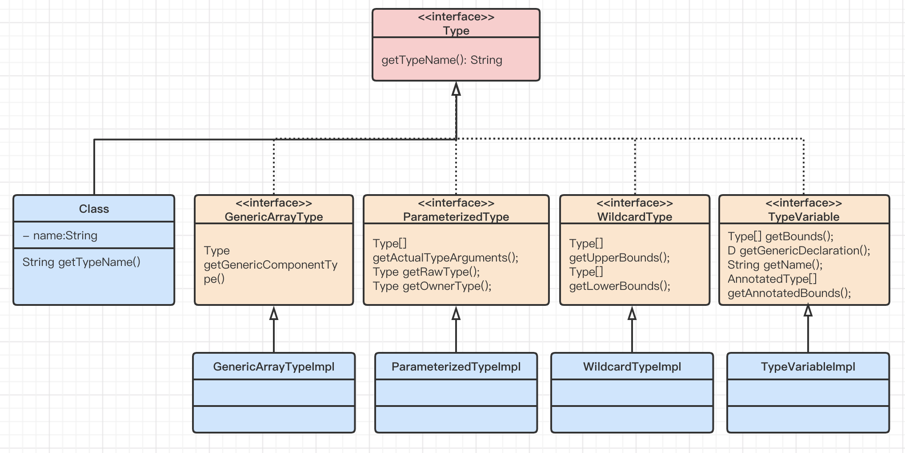

[Oracle Java 泛型官方教程-英文版
](https://docs.oracle.com/javase/tutorial/java/generics/index.html)
[Oracle Java 泛型官方教程-中文版](https://pingfangx.github.io/java-tutorials/java/generics/index.html)
[本文完整测试代码-GitHub]()

# 一. 打破砂锅问到底

- ##### 什么是泛型？Java 泛型的来源？
- ##### 什么是泛型？Java 泛型的来源？
- ##### 什么是泛型？Java 泛型的来源？
- ##### 什么是泛型？Java 泛型的来源？


# 二. 晓之以理动之以码

### Q：什么是泛型？Java 泛型的来源？
### Q：简单说一下 Java Type 体系？


 


测试代码：

```

```

